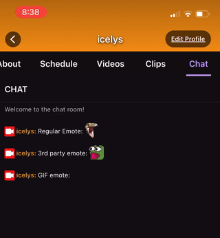

# twitch-mobile-emotes

An HTTP server that intercepts and modifies Twitch's IRC-over-WebSockets chat and its emoticon CDN to introduce
BetterTTV and FrankerFaceZ custom emotes to native chats, specifically on mobile.



You must run this program behind some reverse proxy that can apply SSL certificates for the
domains `static-cdn.jtvnw.net` and `irc-ws.chat.twitch.tv`. I choose to use a self-signed certificate that is trusted on
my devices. See the `nginx` folder for an example.

By using a tool like PiHole (which is just dnsmasq with a GUI), you can create custom A/CNAME records that will point 
both `static-cdn.jtvnw.net` and `irc-ws.chat.twitch.tv` to the IP of the emote server on your local network or behind 
a VPN.

## How it works

This program intercepts every chat message between you and Twitch and checks the text for a custom emote. If a custom
emote is found, it modifies the message's `@emotes` tag to include the custom emote with a unique ID.

For instance, say the server detects the FrankerFaceZ `OMEGALUL` emote with ID `128054` at index `0-7`.`

The server modifies the emotes tag to include an emote that starts with the letter `f` (or the letter `b` in the case of
BTTV emotes), as such:

`... @emotes=f128054:0-7 ... :OMEGALUL`

Normally, the mobile app makes a request in the form of

`https://static-cdn.jtvnw.net/emoticons/v1/<emote id>/<size>`

to load the image.

However, when the unknowing client makes a request to

`https://static-cdn.jtvnw.net/emoticons/v1/f128054/4.0`

nginx detects the custom emote from the first character of the ID and forwards the request to the emote server, which then returns
a `302 Found` code to the emote image.

Real Twitch emotes that start with a digit instead of a `f` or `b` are passed on to the real `static-cdn.jtvnw.net` by
nginx.

With Twitch's v2 emote CDN, the process is identical but with slightly different URLs. Requests with emote IDs that don't start with `emotesv2` are forwarded to the emote server. Additionally, GIF support allows for GIF 3rd party emotes.

## Building

Build from source

```bash
$ go build ./cmd/emote-server
```

...or use the [docker container](https://github.com/dnsge/twitch-mobile-emotes/packages/531933):

```bash
$ docker pull ghcr.io/dnsge/twitch-mobile-emotes/twitch-mobile-emotes:latest
```

## Usage

```
Usage of emote-server:
  -address string
        Bind address (default "0.0.0.0:8080")
  -cache string
        Path to cache files (leave empty to disable)
  -emoticon-host string
        Host header to expect from Emoticon requests (default "static-cdn.jtvnw.net")
  -ideal-gifs string
        Path to ideal gif frames file (leave empty to disable, only works with file cache)
  -no-gifs
        Disable showing gif emotes
  -purge
        Purge cache on startup
  -ws-host string
        Host header to expect from Websocket IRC requests (default "irc-ws.chat.twitch.tv")
```

`emote-server` checks `Host` headers to determine which handler HTTP requests should be sent to (either emote CDN or IRC
WS).

Use the `--emoticon-host` and `--ws-host` flags to tell the server what to expect.

If you want to disable gif emotes, pass the `--no-gifs` flag.

### ideal-gifs

**NOTE: This feature is no longer needed as Twitch has updated its mobile app to natively support GIF emotes**

By default, Twitch displays the first frame of a GIF emote, which sometimes is empty/incomplete. The ideal-gifs file
allows for the specification of which frame to use for a GIF emote.

_Note: frames are indexed starting at 0._

File format:

```text
# Comment
<letter code>:<id>:<frame index>

<letter code>:<id>:<frame index> # End of line comment
```

For example,

```text
b:5fa179c2710f8302f0c9e09e:5 # monkaX Christmas Emote
```

will render the `monkaX` BTTV GIF emote (christmas version) on the 5th frame.
